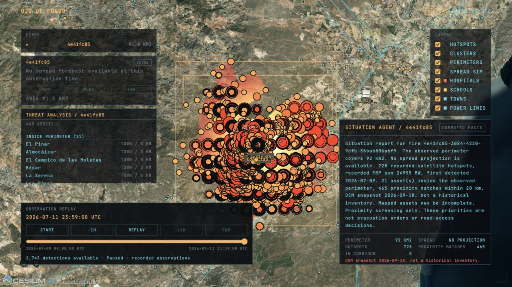

# Ojo de Fuego

A real-time wildfire intelligence console for Spain — satellite hotspots, observed perimeters and
an infrastructure proximity report on a 3D globe, with a road-egress engine behind it that answers
when the road out closes and whether a village can still leave.



Built at [HackBarna 2026](https://hackbarna.com) (Barcelona, 19–20 September 2026), tracks
**Monitoring active fires** and **Values at risk**.

> The console renders hotspots, clusters, perimeters, infrastructure and the situation report. It
> does **not** render road cut times, alert packages or the decision ledger — those answer over
> HTTP only. See [The HTTP API](#the-http-api).

## What it is

**The console** is a 3D globe (CesiumJS) over Iberia under a dark overlay of panels and readouts.
It draws eight layers you can toggle — hotspots, clusters, observed perimeters, infrastructure —
and lets you select a fire
to get an analysis of what is near it and a report describing it. It reads four endpoints and
nothing else.

**The server** is a thin Express proxy. It keeps the Deepfire API key out of the browser,
normalises the upstream responses into one flat shape, does the geometry with turf.js, and serves
the road-egress engine. It exposes thirteen `GET` routes. Four back the console; nine more answer
over HTTP with no console surface yet — road cut times, last-safe-departure bands, CAP packages and
the recommendation ledger, whose panels are scoped in issues
[#35](https://github.com/eldtechnologies/hackbarna-wildfire/issues/35) to
[#38](https://github.com/eldtechnologies/hackbarna-wildfire/issues/38), plus the over-alerting
figure, which has no console surface planned.

**How it handles what it does not know.** Replay is the default and the demo path: a real capture
of the July 2026 Los Gallardos fire, with no fire-data API called and no key needed. Every
response says whether it came from `live` or `replay`. A value the source did not supply is
`null`, never a plausible number. The thermal model is a research experiment, and its endpoint
says so in the response body rather than in a footnote.

The demo capture holds 2,743 hotspots and 12 observed perimeters. The repository also carries
8,079 infrastructure assets, a 13,069-node road graph, 13 API routes and 31 test files.

## Quick start

### Prerequisites

- **Node.js ≥ 22.9** and npm.
- A **desktop browser with WebGL2** — Cesium needs it, and the HUD is built for a wide viewport.
- **Network access** for two remote assets: the keyless Esri satellite basemap and the JetBrains
  Mono webfont. Neither needs a key, but replay mode is not fully offline without them.

### Run it

```bash
npm install
npm run dev
```

`npm run dev` starts both halves: the Vite client on <http://localhost:5173> and the Express proxy
on <http://localhost:3001>. The client proxies `/api/*` to the server, and both read the port from
`server/config.ts`, so they cannot disagree about it.

Open <http://localhost:5173>. You should get the globe over Iberia, the HUD, and a cyan **REPLAY**
badge. Check the server directly with:

```bash
curl localhost:3001/api/health
# {"status":"ok","service":"ojo-de-fuego","mode":"replay","time":"..."}
```

### Verify the build

```bash
npm run typecheck   # client and server, strict
npm test            # 31 test files, Node's built-in runner
npm run build       # production bundle into dist/
```

CI runs all three on Linux, macOS and Windows across Node 22.9 and 24
([`.github/workflows/ci.yml`](.github/workflows/ci.yml)).

## The console


Everything is drawn on one Cesium globe with a DOM overlay on top. There is no second view and no
sidebar page: selecting a fire opens panels over the globe, and deselecting closes them.

| Layer | What it draws |
|---|---|
| **Hotspots** | Satellite fire detections as pulsing points, sized and coloured by fire radiative power. A null FRP draws smallest and coolest — "not measured", not "cold". |
| **Clusters** | The upstream cluster grouping of those hotspots, as a bounding rectangle with a ground-clamped outline. |
| **Perimeters** | Observed fire polygons, filled with an animated heat gradient — white-hot core through HUD amber to a dark red rim. The selected fire is drawn brighter than the rest. |
| **Spread sim** | The projected perimeter and its drift, described below. |
| **Hospitals** | Point assets, `#ff5a5e`. |
| **Schools** | Point assets, `#ffc857`. |
| **Towns** | Point assets, `#4fd8e8`. |
| **Power lines** | ≥110 kV transmission lines, `#4fd8e8`. |

All eight start visible. The four infrastructure layers carry a colour swatch in the HUD legend;
the four fire layers deliberately do not, because their colour is data-driven rather than fixed.

## Using the console

### The HUD

Corner brackets, the title, a UTC clock ticking in real time, and a telemetry line showing the
cursor's latitude and longitude and the camera's altitude. The LIVE/REPLAY badge is **automatic**:
it reflects the `provenance` field of the last fire response, so it cannot claim live data that
did not arrive in live mode.

### Selecting a fire

Three interchangeable routes, all ending in the same state:

- Click a row in the **FIRES** list.
- Click a fire's **perimeter** polygon on the globe.
- Click a fire's **pick marker**.

The camera flies to frame the fire, the close button on the scrubber appears, the **threat panel**
fills with the assets near the fire, and the **situation panel** fills with its report. Clicking
empty space or the panel's close button deselects.

### Observation playback

The **Observation replay** panel plays recorded evidence, including the Los Gallardos capture.
Start/End, ±1H and the slider send `?at=<seconds>` to the server. The date above the slider always
belongs to the snapshot currently on the map. Play advances half an event-hour per loaded frame;
Pause freezes the current snapshot. It stops at the end, where Replay starts again from the
beginning.

Hotspots, cluster geometry, observed perimeters and the selected fire's threat and situation
reports all follow the same cursor. While a new frame loads, the previous one stays visible; if
loading fails, playback stops and offers Retry rather than labelling the old frame with a new
time. Layer visibility and camera position survive scrubbing.

Stepping the cursor through the July capture is where you watch the fire itself grow: the observed
perimeter runs from about 33 km² to about 92 km² across the capture. That is observation, not
prediction.

The source selector changes data for this browser only: **Live satellite observations**
and **Recorded fire · Los Gallardos**. A configured
`REPLAY_SNAPSHOT` is also available as **Configured recording**. Source and cursor
travel together through fire, threat, situation and growth requests (`source=live|replay|configured`).

Use **RESET** to reset spread playback, **REFRAME** to repeat the fire camera flight,
and **IBERIA** to return to the overview. **PANELS** hides or restores the inspectors
for a clear map view on smaller screens. The fire list includes clusters without
perimeters. Threat ring headings always show their counts when assets are available;
expand a ring for its assets. Reports show the first eight computed priorities,
with **SHOW ALL** for the full list.

**SENSOR** applies a high-contrast monochrome visual filter to the map. It does not
supply FLIR imagery or measured temperatures. **MAP: OFFLINE GRID** uses a locally
rendered coordinate grid under the fire and infrastructure layers. Imagery errors
also switch to this grid, with a visible status. Satellite imagery needs internet;
local replay, geometry and the template report do not.

### The spread simulation

The spread scrubber is a different control from the playback panel, and it is deliberately
separate. It offers a `T+` readout, the absolute `VALID` time the projection refers to, `-1H` /
`PLAY` / `+1H` buttons, a slider snapped to quarter-hours, horizon ticks, and `AREA` and `DRIFT`
statistics. `PLAY` advances half a fire-hour per real second, holds two seconds at the far horizon,
and loops.

When the selected fire carries no forecast polygons the controls are **disabled**, with the reason
shown next to them: *"No spread forecast available at this observation time."* A recorded
observation is not a prediction, and the panel does not let you mistake one for the other. The
committed Los Gallardos capture contains no forecast steps, so that is what a fresh checkout shows.

When it does have steps, the projection interpolates between the provider's forecast polygons.
**It is not a wind field.** The fire schema carries no measured wind, so the drift bearing is
computed from the centroid of the observed perimeter toward the furthest projection — a derived
heading, not an observation.

### Inspecting a hotspot

Click any hotspot for a metadata card: detection time, confidence, source satellite, fire
radiative power, position and cluster. This is the raw evidence the rest of the console reasons
over.

### Infrastructure and the threat panel

Click an infrastructure asset and the camera flies to 15 km above it. For a *selected fire*, the
threat panel lists every asset inside the perimeter, inside the 5/10/20 km rings, or inside the
projected spread corridor, sorted innermost ring first and then by distance.

All four rings are listed whether or not they contain anything, so an empty ring reads as "nothing
here" rather than "not evaluated". Power lines are sampled every 500 m along their length, so a
span crossing a ring is not missed between vertices.

### The situation panel

The report is rendered by the server, not the browser. Each card carries a badge saying how it was
ordered — `COMPUTED FACTS` when the deterministic template ordered the facts, `AI ORDERED FACTS`
when a model reordered them — a grid of the underlying figures, the caveats that apply to them, a
ranked proximity list, and a footer naming the evidence time and its provenance.

The model, when configured, may only return an ordering of fact IDs that the server supplied.
Every number and every name comes from the server's packet.

### What the console does not show

Cut times, last-safe-departure bands, CAP alert packages and the recommendation ledger are
computed and served, but no panel renders them yet. If you want them, use the API —
[`docs/API.md`](docs/API.md) documents all thirteen routes.

## The HTTP API

Thirteen `GET` routes, no authentication, no rate limiting, bound to loopback by default.

| Route | Returns | Console |
|---|---|---|
| `GET /api/fires?at=<s>` | Hotspots, clusters, observed perimeters, spread, timeline | yes |
| `GET /api/infrastructure` | Bundled hospitals, schools, towns, power lines | yes |
| `GET /api/threats?fireId=&at=<s>` | Assets inside the perimeter, the 5/10/20 km rings, or the spread corridor | yes |
| `GET /api/situation?fireId=&at=<s>` | Evidence facts, proximity priorities, narrator badge | yes |
| `GET /api/health` | Liveness and the configured data mode | — |
| `GET /api/growth?clusterId=&at=<s>` | Detection-centroid motion beside offline corpus baselines | — |
| `GET /api/forecasts[?eventId=&issue=]` | Prepared native-grid thermal forecasts | — |
| `GET /api/egress?at=<s>` | Pockets, routes out of each, the last-safe-departure band | — |
| `GET /api/egress/field` | The cut-time field over the road network | — |
| `GET /api/reach` | Population inside a cell footprint for a fire that does not reach it | — |
| `GET /api/alerts?at=<s>` | CAP packages, the rejection log, the decision ledger | — |
| `GET /api/cap/:pocketId?at=<s>` | One CAP 1.2 XML document | — |
| `GET /api/ledger?limit=<n>` | The recommendation history in recorded order | — |

`?at=` is seconds since the scenario origin, and every route that takes a cursor means the same
thing by it. A malformed cursor is a `400` rather than a silent fall back to the latest state.

```bash
# the fire picture at the live edge of the committed capture
curl -s localhost:3001/api/fires | jq '{provenance, asOf, hotspots: (.hotspots|length), clusters: (.clusters|length)}'
# {"provenance":"replay","asOf":"2026-07-11T23:59:00.000Z","hotspots":2743,"clusters":7}

# what is near one fire
curl -s "localhost:3001/api/threats?fireId=$(curl -s localhost:3001/api/fires | jq -r '.clusters[0].id')" | jq '.rings'

# when the road out of Bédar closes, as a band over 24 solves
curl -s localhost:3001/api/egress | jq '.pockets[0].routes[] | {id, usable, lastSafeDeparture}'

# one alert package as CAP 1.2
curl -s localhost:3001/api/cap/bedar
```

Full parameter semantics, status codes and response shapes: [`docs/API.md`](docs/API.md).

## Configuration

Put values in a `.env` file at the project root (gitignored, auto-loaded by `npm run server`).
Every one is optional except `DEEPFIRE_API_KEY` for live mode. See
[`.env.example`](.env.example) for the annotated list.

| Variable | Default | Effect |
|---|---|---|
| `DATA_MODE` | `replay` | `live` calls Deepfire; anything else replays. |
| `REPLAY_SNAPSHOT` | `los-gallardos-2026-07-09.json` | Which snapshot replay serves. See below. |
| `PORT` | `3001` | Express port. Shared with the Vite proxy. |
| `HOST` | `127.0.0.1` | Interface to bind. `0.0.0.0` exposes the unauthenticated routes and spends Deepfire quota from anywhere on the network. |
| `DEEPFIRE_BASE_URL` | `https://api.deepfire.co` | Upstream OGC API Features base. |
| `DEEPFIRE_ALLOWED_HOSTS` | `api.deepfire.co` | Comma-separated allowlist for the base URL's host. A host outside it throws on the first live request rather than at startup, so the server still starts and falls back to replay. Add the host when pointing `DEEPFIRE_BASE_URL` at a mirror. |
| `DEEPFIRE_API_KEY` | *(empty)* | Bearer token for live mode. Empty in live mode throws on the first request and the server answers from replay instead. |
| `DEEPFIRE_BBOX` | `-10,35,4,44` | Live query window, `west,south,east,north`. |
| `DEEPFIRE_WINDOW_HOURS` | `24` | Hotspot history to request. One day per upstream request. |
| `DEEPFIRE_ACTIVE_ONLY` | `true` | Only what the API marks active; otherwise every detection it still holds. |
| `LLM_BASE_URL` | `https://api.openai.com/v1` | Chat-completions base for the situation narrator. |
| `LLM_API_KEY` | *(empty)* | Empty means no model is ever called and the report uses the deterministic order. |
| `LLM_MODEL` | `gpt-4o-mini` | Model name. The provider must support `max_completion_tokens`. |
| `LEDGER_PATH` | `data/ledger/recommendations.jsonl` | Where recommendations are appended. The server refuses to start if it is unusable. |
| `FORECAST_DIR` | *(unset)* | Directory of prepared thermal forecasts. Unset serves an empty list. |
| `OPENCELLID_TOKEN` | *(empty)* | Read **only** by `scripts/fetch-reach.mjs`. The running server never reads it. |
| `OPENCELLID_BASE_URL` | `https://opencellid.org` | Base URL for `scripts/fetch-reach.mjs`; override only for a mirror. |

## Deepfire credentials

The server reads exactly one credential: **`DEEPFIRE_API_KEY`**, sent as `Authorization: Bearer`.
There is no token exchange in this repository.

The published API issues a token from a `client_id` / `client_secret` pair rather than a static
key. The two are not interchangeable, so live mode means exchanging the pair out of band and
putting the resulting `access_token` into `DEEPFIRE_API_KEY`:

```bash
# .env is auto-loaded by `npm run server`, not by your shell, so load it here.
set -a; . ./.env; set +a

# The body goes in on stdin so the secret never becomes a process argument.
curl -s -X POST "https://api.deepfire.co/v1/token" \
  -H "Content-Type: application/json" --data-binary @- <<JSON
{"client_id": "$DEEPFIRE_CLIENT_ID", "client_secret": "$DEEPFIRE_CLIENT_SECRET"}
JSON
```

The response carries `access_token`, `token_type: "Bearer"` and `expires_in` — about 180 days,
with no refresh token. Keep the client pair in `.env` for the exchange, but note that the server
itself never reads them: `DEEPFIRE_CLIENT_ID` and `DEEPFIRE_CLIENT_SECRET` are used by your
exchange step and by nothing else.

An issued token is valid until it expires, and nothing in this repository revokes one — the
server sends whatever `DEEPFIRE_API_KEY` holds. So a leaked token is not repaired by exchanging
the same pair again: the remedy is to rotate the `client_id`/`client_secret` pair and exchange a
fresh one, which invalidates the old pair rather than the token already issued from it. Treat the
token as a long-lived secret and keep it out of anything that retains text.

If `DEEPFIRE_API_KEY` is empty while `DATA_MODE=live`, the first request throws, the provider logs
a warning, and the response comes back from replay with `provenance: "replay"`. The HUD badge
follows, so a misconfigured live mode shows as REPLAY rather than as a failure.

## Data modes and snapshots

`DATA_MODE` selects the source:

- **`replay`** (default) serves a snapshot from `data/snapshots/`. No key, no Deepfire quota.
- **`live`** calls the Deepfire OGC API Features collections and normalises the response. On any
  failure it falls back to the pinned real Los Gallardos capture, regardless of `REPLAY_SNAPSHOT`.
  An eight-second deadline aborts collection requests and retry backoff; the UI names the fallback.
  Seeking that fallback stays on the recording even if the live API recovers.

`live` ignores the `at` cursor: Deepfire has no event timeline, and only the replay path has frame
semantics.

### Which snapshot is served

1. `REPLAY_SNAPSHOT` naming a file in `data/snapshots/` exactly.
2. `REPLAY_SNAPSHOT` as a scenario prefix: the newest `<name>-*.json`. A value that matches nothing
   is an error (`502`), never a silent substitute.
3. `REPLAY_SNAPSHOT` set to an empty value: the newest `.json` in the directory, so a fresh
   recording automatically becomes the demo scenario. Recordings explicitly marked as
   non-observation data are rejected rather than shown as satellite observations.
4. Unset: the default `los-gallardos-2026-07-09.json`.

Two formats live in that directory, both in the raw Deepfire shape so replay goes through the same
normaliser as live data:

- **Flat capture** (one window of observations, delivered progressively): `{scenario, source,
  window, bbox, hotspots, clusters, perimeters}`, e.g. `los-gallardos-2026-07-09.json` — a real
  capture of the July 2026 Los Gallardos fire, 2,743 detections over 9–11 July.
- **Recording** (an event timeline): `{scenario, recordedAt, intervalSeconds, frames: [{t,
  hotspots, clusters, spread}]}`, produced by the record script against a compatible flat observation endpoint.

Both get a `timeline` block at `/api/fires`, and both go through causal replay: a detection
appears only once its assumed delivery time has passed (MTG-I1 17 minutes; VIIRS and MODIS 3
hours; Sentinel-3 6 hours, unless the capture recorded an actual `available_at`). Cluster
association remains retrospective upstream metadata, so this is a **causal evidence replay under
declared assumptions**, not a reconstruction of what an operator received.

### Recording observations

The optional recorder reads flat `/hotspots`, `/clusters` and `/spread` arrays from a
compatible observation endpoint. It does not call Deepfire's OGC collections directly.
Point `DEEPFIRE_BASE_URL` at that endpoint and run
`npm run record:snapshot -- --scenario <name> --frames 8 --interval 15`.
A single frame uses the flat capture format; multiple frames retain their capture times.
The recorder preserves source timestamps without inventing observation, delivery or
forecast issue times. Files land as `data/snapshots/<scenario>-<UTCstamp>.json`.

## The egress engine

`server/engine/` answers a different question from the console: not where the fire is, but when the
road out closes and whether a village can still leave. It reads the committed road graph, Catastro
building footprints, INE population, the July capture and the static-heat fixture once per process,
and offers no network calls at request time.

**Departure times are reported as a range, not a single time.** The same road reads 19:38 CEST or
00:03 CEST depending on which sensors you trust and how wide you draw their footprints, and a
point estimate would hide that choice. The engine sweeps 24 combinations of sensor configuration
and assumption profile and reports the envelope, naming the configuration behind each end; the
`GET /api/egress` section of [`docs/API.md`](docs/API.md) lists the configurations and the band's
field semantics. Over the committed capture: 2,660 detections produce 4,225 cut segments out of
29,834.

`GET /api/egress` returns the pockets and the routes out of each, with a last-safe-departure range
per route, the assumption set printed beside every number, and a per-sensor-family breakdown that
includes the families which contributed nothing. A pocket whose routes all fail the action gate
reports `no_verified_action` — an outcome, not an error.

**The alert package.** `GET /api/cap/:pocketId` emits one CAP 1.2 document per pocket. CAP is the
Common Alerting Protocol, the XML format emergency-management systems exchange; the document is
one `<alert>` with one `<info>` per language. Instruction text comes from a closed set of
pre-approved phrasings — the engine selects one and fills in names, it never composes a sentence —
and each pocket's document is validated against the official OASIS CAP 1.2 schema before it is
served. The tests do the same validation with `xmllint`, and skip cleanly when that binary is not
installed.

**The ledger.** Every recommendation is appended to an append-only store with its evidence, its
input fingerprint, and two timestamps: when the event happened and when the recommendation was
recorded. Reading `/api/alerts` records one if the same inputs have not been seen.

**Reach.** `GET /api/reach` reports the over-alerting figure: population inside a mobile cell's
served footprint for a fire that does not reach it, published with the fraction of cells carrying
a measured range rather than the operator's fallback, and with the survey box the cells were drawn
from — so "unasked" cannot read as "none".

Rebuild the committed data with:

```bash
node scripts/fetch-roads.mjs     # OSM road graph       -> data/graph/
node scripts/fetch-pockets.mjs   # Catastro footprints  -> data/pockets/
node scripts/fetch-reach.mjs     # OpenCelliD cells     -> data/reach/   (needs OPENCELLID_TOKEN)
```

Only `fetch-reach.mjs` needs a credential, and it exits non-zero if any tile failed so a partial
survey cannot be mistaken for a complete one.

## The situation agent

The server writes each fact from computed evidence. A model may only return an ordering of all the
supplied fact IDs; invalid, missing, duplicate or invented IDs fall back to the deterministic
order. Coverage limits and the distinction between proximity screening and an evacuation order
always remain visible. With no `LLM_API_KEY`, the report works with no model call at all.

Bounded on purpose: each caller waits at most four seconds for an ordering, the shared provider
job aborts at fifteen, there are at most two provider jobs and 64 cached orderings, prompts hold
at most eight facts or 8 KB, and completions are capped at 128 tokens. A compatible provider must
support `max_completion_tokens`; a provider that does not returns the template order. The key
lives only in the server environment, never in the browser.

## The growth model and thermal forecasts

Both endpoints publish their own limits, and both should be read with them.

`GET /api/growth` returns descriptive motion of a fire's detection centroid beside two offline
corpus baselines, labelled `validation: "diagnostic_only"`, `roadUse: "unsupported"` and
`scoreScope: "offline_corpus_baselines"`. Those scores describe the corpora, not this estimator,
and the vector does not validate fire-front arrival. The served predictor is `persistence` with
the model slot `null`, because the learned model beats persistence on rate R² but is worse on
bearing error in both corpora. See [stream3-baselines.md](docs/stream3-baselines.md).

`GET /api/forecasts` serves a native-grid thermal forecast whose target is *an observed thermal
detection somewhere within each future 1/3/6-hour window*. It is not a perimeter and not a
road-arrival time: `deployment` is `research_only` and `roadUse` is `unsupported` on every
response. The committed example is a real selection-partition artifact exported with the
persistence fallback, not a trained-model result and not the July incident. Model promotion runs
through the [prospective evaluation gate](docs/thermal-evaluation.md).

The engine is not fed these grids. Converting a thermal forecast into a road-cut time needs
independent contemporaneous progression references and a separately validated arrival model.

## The data pipeline

The training and evaluation pipeline lives in Python under `tools/`, and its detail is in
[`tools/next_run/README.md`](tools/next_run/README.md) — the corrected extraction, weather joins,
masked labels, isolated evaluation roles and training commands. The current pipeline and the
historical one have separate dependency sets. From the repository root:

```bash
python -m pip install -r tools/next_run/requirements.txt   # 58 tests
python -m pytest tools/next_run -q

python -m pip install -r tools/pipeline/requirements.txt   # 23 tests
python -m pytest tools/pipeline -q
```

`uv` works too, and is how this section was last verified:

```bash
uv run --with-requirements tools/next_run/requirements.txt python -m pytest tools/next_run -q
uv run --with-requirements tools/pipeline/requirements.txt python -m pytest tools/pipeline -q
```

`tools/pipeline/` and `data/wildfire-spread/` retain the historical Iberian experiment for audit.
They are explicitly **not** the next training dataset, and their shards must not be mixed with
`tools/next_run`. Legacy build and scoring commands refuse to run without `--legacy-reproduction`;
see [growth-baselines-AP.md](docs/growth-baselines-AP.md) for the old numbers and their limits.

The corpus scores in `data/model/metrics.json` come from `tools/model/harness.py` against corpora
that stay on the data box. Regenerate with:

```bash
STREAM3_DATA_DIR=<corpora> uv run --with geopandas --with pandas --with scikit-learn python tools/model/harness.py
```

The harness writes nothing unless every corpus scored, so a run without the data cannot overwrite
the committed artifact.

## Repository layout

```
src/          Browser client — Cesium globe, HUD, layers, panels
server/       Express proxy
  providers/  replay and live fire data, normaliser, delivery assumptions
  engine/     Road egress — cut times, departure bands, CAP, ledger
  model/      Growth and thermal-forecast serving
shared/       Type contracts shared by the client and the server
scripts/      Fetchers and recording tools (not part of the running service)
tools/        Python pipelines — next_run (current), model, pipeline (historical)
data/         Committed datasets and fixtures
docs/         Design, API reference and evidence
tests/        Client tests
```

## Development and tests

| Command | What it does |
|---|---|
| `npm run dev` | Server and client together |
| `npm run server` / `npm run client` | Either half alone |
| `npm run typecheck` | `tsc --noEmit` over the client and the server project |
| `npm test` | Node's built-in runner over `server/**/*.test.ts` and `tests/**/*.test.ts` |
| `npm run build` | Production bundle into `dist/` |
| `npm run preview` | Serve the built bundle (proxies `/api` like the dev server) |
| `npm run record:snapshot` | Capture a scenario into `data/snapshots/` |

34 test files, 373 tests. The server is well covered — geometry, the cut-time sweep, CAP schema
validation, the ledger, HTTP error paths and startup. The Cesium client is covered thinly: jsdom
suites exercise the situation panel's request lifecycle and the fire layers' state, and everything
that *draws* on the globe is still verified by running it and looking. That is a deliberate trade
for a two-day build, not an oversight.

Contracts live in `shared/` and are type-only: ISO strings rather than `Date`, `LatLon` objects
rather than GeoJSON, ids as strings. The server normalises to that shape once, in
`server/providers/normalize.ts`, and both halves read it from there.

## Limits and non-goals

- **Authority.** Emergency authority sits with the CCAA 112 centres under Ley 17/2015 Art. 12.4,
  and Deepfire's own documentation says their perimeters are estimates, not authoritative for
  safety purposes. This is decision support for coordinators, not a public alerting authority and
  not an evacuation order.
- **Two regions, and they are not equally good.** The bundled infrastructure covers Catalonia from
  Generalitat open data, and eastern Almería from an OpenStreetMap snapshot taken 18 September
  2026. The Catalonia bundle is an administrative inventory; the Almería one is what OSM happened
  to have, it is not a historical inventory, and mapped assets may be incomplete. Every response
  says which region it answered from, with that caveat attached, and the API reports
  `infrastructureCoverage: null` outside both rather than an empty list — so "nothing near this
  fire" can never be confused with "we hold no data here".
- **No measured wind.** The fire schema carries no wind field. Spread direction is a derived drift
  heading, and there is no live weather feed.
- **No physical spread model.** The projection interpolates provider-supplied forecast polygons.
  It is not ELMFIRE, FARSITE or any other fire-behaviour model, and it does not produce arrival
  times.
- **Thermal forecasts are a research target**, not an operational product, and are not wired into
  the egress engine.
- **Unthrottled.** No authentication and no rate limiting. Loopback by default, deliberately.
- **Desktop only.** The HUD assumes a wide viewport and Cesium needs WebGL2.
- **No licence yet.** The repository has no `LICENSE` file.

## Documentation

| Document | What it covers | Status |
|---|---|---|
| [`docs/API.md`](docs/API.md) | Every route: parameters, status codes, response shapes, caching | current |
| [`docs/DESIGN.md`](docs/DESIGN.md) | The original product concept and design language | concept |
| [`docs/work-plan.md`](docs/work-plan.md) | Work streams, owners, the decision record, verification gates | internal plan |
| [`docs/model-proposal.md`](docs/model-proposal.md) | Why the model stays a thermal-forecast experiment | current |
| [`docs/forecast-contract.md`](docs/forecast-contract.md) | The forecast handoff, causal replay and the shared evidence clock | current |
| [`docs/thermal-evaluation.md`](docs/thermal-evaluation.md) | The prospective gate a model must pass before it ships | current |
| [`docs/stream3-baselines.md`](docs/stream3-baselines.md) | Corpus baselines, their units and their scope | current |
| [`docs/training-performance.md`](docs/training-performance.md) | Training throughput measurements and what they do not show | current |
| [`docs/growth-baselines-AP.md`](docs/growth-baselines-AP.md) | The historical MTG baseline experiment | historical |
| [`docs/DATA_SOURCES.md`](docs/DATA_SOURCES.md) | Every data source considered, and the traps in each | reference |
| [`docs/almeria-infrastructure.md`](docs/almeria-infrastructure.md) | Where the Almería infrastructure came from and what it omits | current |
| [`docs/validation/`](docs/validation) | Held-out model validation: protocol, results, and the paired Deepfire comparison | current |
| [`docs/last-safe-departure.md`](docs/last-safe-departure.md) | The spike that established the road-decision problem | historical |
| [`docs/ojo-de-fuego-wildfire-intelligence-console-for-spain.md`](docs/ojo-de-fuego-wildfire-intelligence-console-for-spain.md) | The pre-build concept brief; three of its feature claims were never delivered | superseded |

## Attribution

- **Fire data:** [Deepfire](https://deepfire.co) OGC API Features.
- **Infrastructure:** Generalitat de Catalunya open data (Equipaments de Catalunya, dataset
  `8gmd-gz7i`; Caps de municipi, dataset `wpyq-we8x`). Building footprints from Catastro INSPIRE
  (`bu:Building`). Power lines and the road graph from OpenStreetMap, © OpenStreetMap
  contributors, [ODbL 1.0](https://opendatacommons.org/licenses/odbl/).
- **Cell towers:** [OpenCelliD](https://opencellid.org), CC-BY-SA 4.0.
- **Basemap:** Esri World Imagery, credited on the globe as Cesium requires.
