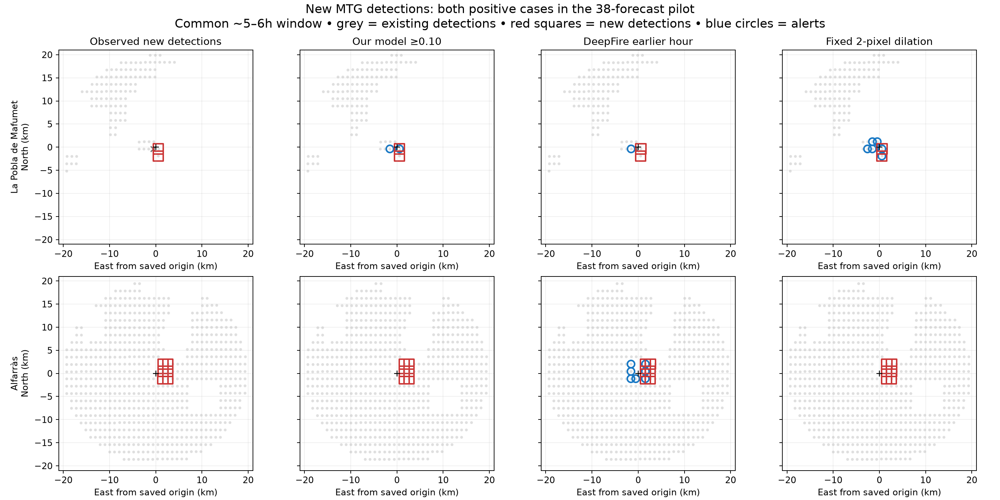

# Paired DeepFire / frozen-model benchmark

Measured 20 September 2026. Protocol fixed at 09:23:36 UTC before inference and scoring. This is a retrospective pilot on **38 forecasts from 36 clusters**, with later dates than the frozen model's training data. **All 38 overlap training geography. Only two forecasts contain new positive satellite cells.** Future observability leaves scorable cells in 24 forecasts (23 clusters) at six hours, and 30 forecasts (29 clusters) at three hours. The other matched forecasts contribute no counts; they are not treated as clear negatives.

## Decision

The current model does not demonstrate reliable new-spread prediction. At the primary 0.50 threshold it misses all eight new satellite-positive cell/forecast pairs. At the prespecified secondary 0.10 threshold it catches one with one extra alert. DeepFire catches three with 64–84 extra alerts on this satellite target. A fixed dilation baseline catches two with four extra alerts and has the highest F1 here.

This does not establish a statistically reliable winner. There are only two positive cases. It also does not test physical burned area, road closure time, or evacuation safety. DeepFire predicts a physical simulation footprint; a footprint without a satellite detection is not proof that the ground did not burn.

## Six-hour comparison: new detections only

Common absolute endpoints; actual future observation windows are approximately 5–6 hours because DeepFire starts between our model's whole-hour issue times. Primary radius: 20 km. **7,965 eligible cell/forecast pairs, eight positive pairs**. Negative-only cases stay in the score. Fourteen matched forecasts have no eligible six-hour cells after censoring and contribute zero counts.

| Predictor | Found (TP) | Extra alerts (FP) | Missed (FN) | Precision | Recall | F1 |
|---|---:|---:|---:|---:|---:|---:|
| Our model ≥0.50 (primary) | 0 | 0 | 8 | — | 0.0% | 0.000 |
| Our model ≥0.25 | 0 | 0 | 8 | — | 0.0% | 0.000 |
| Our model ≥0.10 (secondary) | 1 | 1 | 7 | 50.0% | 12.5% | 0.200 |
| DeepFire, earlier hour | 3 | 64 | 5 | 4.5% | 37.5% | 0.080 |
| DeepFire, later hour | 3 | 84 | 5 | 3.4% | 37.5% | 0.063 |
| Fixed 2-pixel dilation | 2 | 4 | 6 | 33.3% | 25.0% | 0.286 |
| Persistence | 0 | 0 | 8 | — | 0.0% | 0.000 |

“Extra alert” means a predicted positive cell with all scheduled future thermal quality flags clear; it is an FP against this thermal target. Precision is undefined when no alert is made. Do not describe precision as overall accuracy. No thresholds were tuned on these results.

## Three-hour comparison

Approximately 2–3 hours of common future observations; 12,971 eligible pairs and seven positive pairs.

| Predictor | Found (TP) | Extra alerts (FP) | Missed (FN) | Precision | Recall | F1 |
|---|---:|---:|---:|---:|---:|---:|
| Our model ≥0.50 (primary) | 0 | 0 | 7 | — | 0.0% | 0.000 |
| Our model ≥0.25 | 0 | 0 | 7 | — | 0.0% | 0.000 |
| Our model ≥0.10 (secondary) | 1 | 1 | 6 | 50.0% | 14.3% | 0.222 |
| DeepFire, earlier hour | 0 | 56 | 7 | 0.0% | 0.0% | 0.000 |
| DeepFire, later hour | 1 | 80 | 6 | 1.2% | 14.3% | 0.023 |
| Fixed 2-pixel dilation | 1 | 4 | 6 | 20.0% | 14.3% | 0.167 |
| Persistence | 0 | 0 | 7 | — | 0.0% | 0.000 |

The 10 km sensitivity gives exactly the same TP, FP and FN as 20 km at both horizons. Only true-negative counts change.

## Both cases with new detections

- **La Pobla de Mafumet, Tarragona**: two new positive cells at six hours. Our model at 0.10 finds one with one extra alert; DeepFire finds zero with one extra alert; fixed dilation finds both with four extra alerts.
- **Alfarràs, Lleida**: six new positive cells. Our model at 0.10 finds zero; DeepFire finds three with four to seven extra alerts; fixed dilation finds zero.



Grey crosses are model-time detections, red square outlines are later new detections, and blue circles are alerts on eligible new-detection cells. Each mark is a native cell centre; it is not a precise fire perimeter. All panels show the same 20 km region. Cells without eligible observations do not enter the scores.

## Equal-cluster check

For the two clusters with multiple forecasts, each forecast gets weight 1 / number of forecasts in that cluster. Weighted counts are pooled, so each cluster has equal total forecast weight. This is not the mean of per-cluster F1 values.

| Predictor | Found (TP) | Extra alerts (FP) | Missed (FN) | Precision | Recall | F1 |
|---|---:|---:|---:|---:|---:|---:|
| Our model ≥0.50 (primary) | 0 | 0 | 5 | — | 0.0% | 0.000 |
| Our model ≥0.25 | 0 | 0 | 5 | — | 0.0% | 0.000 |
| Our model ≥0.10 (secondary) | 1 | 1 | 4 | 50.0% | 20.0% | 0.286 |
| DeepFire, earlier hour | 1.5 | 59.5 | 3.5 | 2.5% | 30.0% | 0.045 |
| DeepFire, later hour | 1.5 | 75.5 | 3.5 | 1.9% | 30.0% | 0.037 |
| Fixed 2-pixel dilation | 2 | 4 | 3 | 33.3% | 40.0% | 0.364 |
| Persistence | 0 | 0 | 5 | — | 0.0% | 0.000 |

These are weighted cell counts, not numbers of independent fires. Clusters with unobservable forecasts have correspondingly incomplete evidence under these fixed weights. No cell-level confidence interval is reported: it would overstate the amount of independent evidence.

## Input and target audit

1. Select all completed, exact-cluster-linked runs in the previously saved 500-run archive for which the model issue plus six hours fits inside the local raw archive. This yields 38 of 45 such runs; seven exceed archive coverage. No outcome-based selection or preparation failures.
2. Use the archived simulation origin as the fixed patch centre. Our issue time is the whole hour at or before the archived DeepFire creation time. Our inputs are 2.73–59.39 minutes older. Location information is therefore supplied from the DeepFire issue, while dynamic features are cut off at the earlier model hour. This is not a simultaneous operational replay.
3. Reconstruct the frozen 64×64 native-grid features using only available history through that hour. Weather is the same previous-day forecast product used by training. Source product availability is checked. Static terrain is unchanged. One original held-out input and persistence field reproduce bit for bit.
4. Freeze all 38 model predictions before reading future label values. Model probabilities come from the original checkpoint and calibration; no retraining or model promotion.
5. Start the shared label window at the first ten-minute scan at/after DeepFire creation. End at our issue +3h or +6h. For new-detection scoring, exclude any cell with a detected fire in the preceding three hours through that start, and any positive frozen input-history bin. Require observable model history and exclude the frozen pre-training persistent-heat prior.
6. A future cell is positive if any scheduled quality flag is 1 or 2. It is negative only when all scheduled flags are 0. Cloud, missing and otherwise unknown cells are censored rather than labelled negative.
7. Transform saved DeepFire hourly polygons into the exact MTG native grid. Rasterize with the fixed `rasterio.features.rasterize(all_touched=True)` rule. Union polygons through both the floor and ceiling forecast hour around the common absolute endpoint. Report both time brackets.
The independent geometry check found one narrow boundary intersection (44.25 m²) that the rasterizer omits. It lies in a previously positive cell: no new-detection score changes. An exact-intersection rasterizer would add one TP and remove one FN in the secondary all-cell, three-hour DeepFire-earlier result at both radii. We retain the preregistered rasterizer and record this implementation limit; “any intersection” in the frozen protocol names the intended all_touched rule, not an exact computational-geometry guarantee.

8. DeepFire documentation defines the result as hourly spread polygons and clusters as candidate fires ([fire-spread API](https://docs.deepfire.co/api/fire-spread), [clusters API](https://docs.deepfire.co/api/clusters)). The archive does not expose all internal simulation inputs; this audit cannot prove the provider’s full input causality.
9. Score the same eligible cells for every predictor. Fixed dilation expands the model-time persistence state by two native grid pixels. Native pixels have varying ground footprints; these outputs do not resolve individual roads or buildings.

The original model's strongest held-out evaluation and this comparison have different cohorts and targets; their AP values must not be compared to these F1 values. All cases here are later in time, but familiar in geography. Some satellite hotspots may be non-wildfire heat sources. These are additional reasons to avoid claiming proven wildfire or evacuation performance.

## Reproduction and frozen handoff

Two independent executions produce **exactly equal aggregate scores and all 114 array files** (38 inputs/predictions + 76 horizon labels). Input parity is exact for the original held-out sample. A separate scikit-learn confusion-matrix rescore matches all 2,128 predictor/case rows, including the empty masks. See `verification.json`.

[frozen-benchmark.zip](frozen-benchmark.zip) holds fixed inputs, predictions, labels, weather, simulation records, protocol, case selection and source snapshots. [SHA256SUMS.json](SHA256SUMS.json) records file identities. Raw MTG archives, original training data and original checkpoint are local prerequisites for a full reconstruction; their hashes and locations are recorded in the protocol/manifest. The zip is sufficient to rescore cached predictions and reuse the fixed evaluation target. It contains no API credentials.

For a full reconstruction, use the scientific Python environment with the original trainer and data-work root, and make a fresh directory containing `protocol.json`, `eligible.json` and `weather/` from the bundle:

```sh
python tools/validation/paired_deepfire.py \
  --data-work-root /path/to/original/work \
  --run-directory /path/to/fresh/run \
  --archive-directory /path/to/bundle/simulations
```

The runner refuses an existing frames directory. It pins the original checkpoint, trainer and manifest identities. The paths inside the original manifest must still resolve. This is a frozen run-001 benchmark, not a generic checkpoint loader.

When the next checkpoint is ready, use these exact case IDs, labels, masks, horizons and thresholds. First check whether the new training process has seen these dates or labels. If it has, any score gain here is a development-set result; it cannot establish held-out improvement. A changed architecture or feature schema needs its own past-only input adapter and parity checks.
